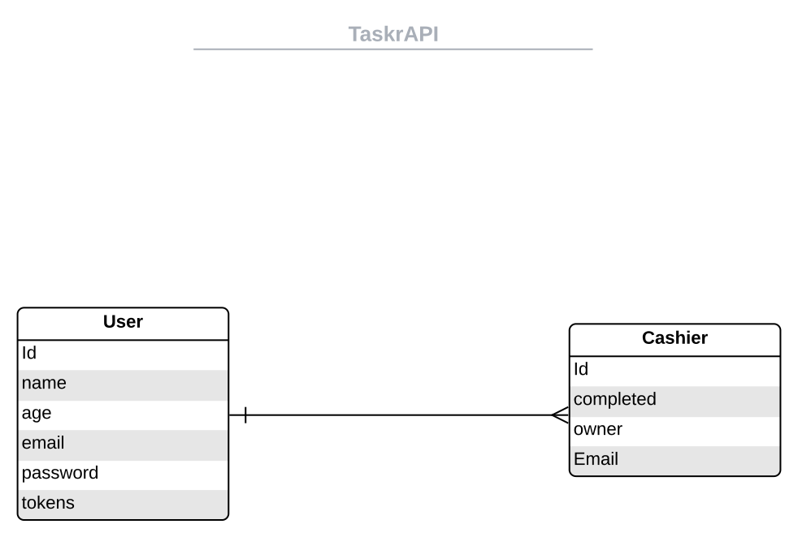

# Taskr
 
This repo hosts the code for a Task App that uses a REST API to allow users to perform operations to a MongoDB database in the backend.  

# Before Deployment

## Dependencies

- Run `npm install` to install all required dependencies.

- Create a config directory under the root directory
    `dev.env` file for the dev server and add the private API_KEYS 
    `test.env` file for the test server and add the private API_KEYS 

    Note: Remember to add these files to `gitignore`

- Run `npm run dev` to start the dev server

- Run `npm run test` to start the test server
    
- Run `npm start` to start the prod server 

- Visit `localhost:3000` in a browser window to access the REST API

## Database
- The API uses a MongoDB cloud cluster as its production database.
- Here's a basic ERD for my DB

# API Endpoints

## User Model

- GET User /users/me

- GET User by Id /users/id
 
- POST Create User /users

- POST Login User /users/login

- POST logout User /users/logout

- POST Logout All /users/logoutAll

- PATCH Update User /users/me

- DELETE Delete User /users/me

- POST Upload/Update Avatar  /users/me/avatar

- DELETE Delete Avatar /users/me/avatar

## Task Model

- GET Task by Id /tasks/id 

- GET Tasks /tasks?sortBy=createdAt:asc/desc& 

- POST Create Task /tasks

- PATCH Update Task /tasks/id 

- DELETE Delete Task /tasks/id

# API Docs

API doc generated using POSTMAN and can be found [here](https://documenter.getpostman.com/view/14939228/2s9Yyy9eeb)!

# Concepts learned:

- MongoDB and Mongoose
- Promises
- REST API
- Promise Chaining
- Async/Await
- Authentication using JWT 
- Middleware
- API Testing with Postman
- Postman Env Set-up & Auth Set-up
- Software Testing with Jest
- Pagination/Sorting
- File Uploads
- Testing Using Jest
  

# Deployment

The app is deployed to Heroku!

